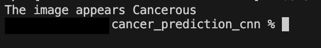

# Cancer Prediction Using Neural Network

## Overview 

The purpose of this project was to create a neural network which classifies breast ultrasound images into two categories, presenting cancer, or not presenting cancer. A neural network is an Artifical Intelligence method which replicates human brain to process data and learn from it. Since the model classifes the images into two categories, the problem was of binary classification. A Convolutional Neural Network was created for this binary classification problem. The neural network was created and data preprocessing was done using the libraries tensorflow, keras and numpy. Data Augmentation was done to increase the training set to improve the models performance. Early stopping was used to improve the models performance as well. The details of these techniques are provided below. The parameters for the neural network were determined by hyperparameter optimization. The model was trained using training data in the train folder and tested using testing data in the test folder. The trained model was then saved to be used in the future. In another file named ```script.py```, a program was written which asks the user for the input of the image, and prints out the results using the saved model.

### Dependencies

The libraries ```tensorflow```, ```keras```, and ```numpy``` are required for this project, and to use the ```script.py``` file. 

### Input format for the images

The supported images can be of variety of types including ```png```, ```jpeg``` or ```jpg```. However, the images need to be in rgb format. The target size is (256, 256). As long as this is taken care of, the model should run correctly. 

## How to Use
You need to have python installed in your system. 
Download python using the site ```https://www.python.org/downloads/```
Clone this repository. 
Open the terminal and make sure you are in the directory of this repository.

1. Install the requirements: Do this using the command ```pip3 install -r requirements.txt```
2. Run the script.py file using the command ```python3 script.py```
3. Enter the path of the image
4. Get the output

## About the Dataset

The dataset includes breast ultrasound images. There are two types of images, one having cancer, and another without cancer. All the images have been split into training data and testing data. Training data was used to train the model, and the testing data to test the model. 

These images were collected from:

    1. Kaggle: Some of the training and testing data was collected from this site: https://www.kaggle.com/datasets/aryashah2k/breast-ultrasound-images-dataset. 

    2. A Local Hospital

The sources are trusted and valid data is used. 

Inside the ```train``` folder, there are two more folders named ```cancer``` and ```normal```. The ```cancer``` folder contains images of breast ultrasound presenting cancer, both benign and malignant types.  The ```normal``` folder contains normal breast ultrasound images with no cancer. This distribution of data is similar for the ```test``` folder. The testing folder has fewer images than the training folder. 

There are ```1007``` in the ```train``` folder, and ```538``` images in the ```test``` folder

## Making the Model: model.ipynb

A Convolutional Neural Network was made which was trained and then used to make some predictions. Libraries named tensorflow and keras were used for making the model and image manipulation. 

The following steps were taken to make the model and train it. 

### 1. Data Augmentation: 
Data Augmentation is the generation of new data from already existing data using certain parameters to specify how the new data must be generated. This increases the size of training data and provides the Neural Network more data to work with and learn from, which increases its accuracy. 

New Data was generated using ```ImageDataGenerator``` Class, and parameters like ```shear_range```, ```zoom_range```, and ```horizontal_flip``` were used to specify the data to be created. 

### 2. Adding the Layers of the Neural Network. Determining the architecture of the neural network.

1. The CNN is instantiated as s Sequential model using the command ```cnn = tf.keras.models.Sequential()```. 

A 2D convolution (```Conv2D```) layer was added. The layer contains filters, which slides across the input image, performing a mathematical operation named colvolution and after the computation, gives an output. These filters are responsible for detecting specific features of an image like corners, edges, and a lot more. After the convolution operation, an activation function is applied to the output. These filters are small matrices.

There are 3 such layers, each with the number of ```filters``` being 32, ```kernel_size``` being 3 x 3 and the activation function being applied called ```relu```. The kernel_size refers to the dimensions of the filters or matrices. 


2. Max Pooling Layers. This layer extracts important features from the input. The ```MaxPool2D``` layer takes as input a feature map obtained from the convolution layer. The layer then performs an operation to select the maximum value in each patch of the feature map obtained from the convolution layer. This layer helps in dimensionality reduction and it reduces the spatial dimensions. This leads to more efficient models because it helps focus on the important features only. 

There are 3 such layers with ```pool_size = 2``` and ```strides = 2```. The ```pool_size``` refers to a tuple of two integers which states the dimensions of the pooling windows. ```strides``` determines the number of steps used when moving the pooling window across the input. 

3. Flatten Layer. This layer converts the multidimensional input it gets from all the layers into a one dimensional vector. There is one such layer. 

4. Dense Layer. This layer is also known as a fully connected layer. This layer takes input from all the previous layers and is responsible for classifying the images. The ```units``` in the dense layers refers to the number of neurons present in this layer.  The ```kernel_initializer``` is ```he_normal``` refers to the way the initial weights are set. ```activation``` refers to the activation function used. This activation funciton is applied to the output of each neuron. 

5. Dropout layer. This layer is used to prevent overfitting. It a a regularization technique, and it improves the performance and accuracy of the neural network. The Dropout Rate is 0.2. This is the probability of dropping out each neuron in a layer. 

6. The ouput layer. The last dense layer with ```activation = 'sigmoid'``` is the output layer. 

The structure of the neural network is made. 

### 3. An optimizer is made.
 The optimizer named ```Adam``` was used and the learning rate used was ```0.001```. The function of the optimizer is to update the weights to get a better accuracy. They reduce the loss. 

### 4. Compiling the model. 
The entire model was then compiled. The optimizer was specified. The loss was calculated using the ```binary_crossentropy``` function because the problem is of binary classification. The loss is a way to determine the accuracy of the model. The loss determines the difference between the predicted value and the true value. 

### 5. Early Stopping. 
Early Stopping was a method used to prevent overfitting and stop the training of the model when the model stops performing well during training. Here, ```val_loss``` or validation loss is monitored and the ```patience = 5``` states the number of epochs to wait before stopping the model if ```val_loss``` dosent improve. 

### 6. Training the model. 
Finally training of the model was done by providing it with the training data, testing data or the validation data, specifying the number of epochs and providing it the Early Stopping callback. 

### 7. Saving the model. 
After the traing process is done, The trained model is saved using ```tf.keras.models.save_model(cnn, './')```. This saves the model in the current directory. This model can be used in the future without having to train it again. 

## script.py

This program is responsible for taking the images from the user as input and using the trained model to give a prediction. 

First, some libraries are imported that can load the saved model and manipulate the data to make it fit for the model to take as input. The first library for loading the model is ```tensorflow```. The libraries for data manipulation are ```numpy``` and ```keras```. First the saved model is loaded using ```model = tf.keras.models.load_model('./')``` and stored in a variable named ```model```. Then the path of the image which is to be predicted is taken in using input. After the user provides the input, the image is then loaded using the image funciton of keras library, and the ```target_size``` is set to ```(256, 256)``` which is the size of the image the model can take as an input. This is then stored in a variable named ```image_to_predict```
The image is then converted into an array using the numpy function ```img_to_array```, and the array is stored in a variable named ```image_to_predict```. The shape of the array is then expanded using ```np.expand_dims('img_toarray', axis = 0)```. The rescaling of the image is then done using ```image_to_predict = image_to_predict / 255.0```. Now the image is transformed into a form that the model can take as an input. Now the prediction from the model can be taken using ```result = model.predict(test_image)```. The result is in form of a 2D Array. The result is then converted into a user friendly output and provided to the user. 

# Results

Here is how the training of the model went, and the accuracy of the model. 


The model performs at an accuracy of ```94.05%```. This is a good accuracy. The losses were also decreasing. 

There were only ```1007``` images in the training data, and ```538``` for the testing data. If there were more images, the accuracy of the model would improve even further. Also, with a different proportion of training and testing data, the model would reach its peak accuracy, if 94% is not. 

Inside the folder named ```testing_images``` there are a few images of breast ultrasound presenting cancer, and normal breast ultrasounds. This folder was made to test the ```script.py```, and the model. The images were taken from google. Here is an example of what the output would look like if ```script.py``` is run and ```normal2.jpeg```image is provided in the path. 


Here is an example when ```script.py``` is run and ```benign.png``` is provided in the path. 



# Example of using script.py

#### Open the terminal


#### Change directory into the directory which contains all the files of this repository using ```cd {path of the files}```


#### Run ```script.py``` using ```python3 script.py```


#### Enter the path of the image that you want to test


#### Get the output


